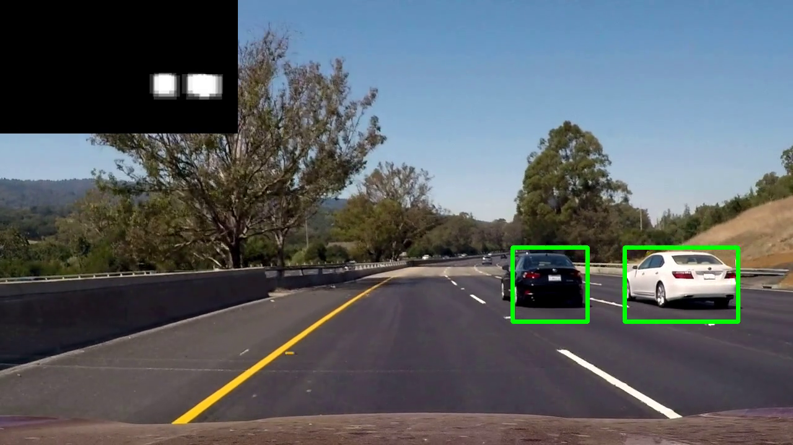
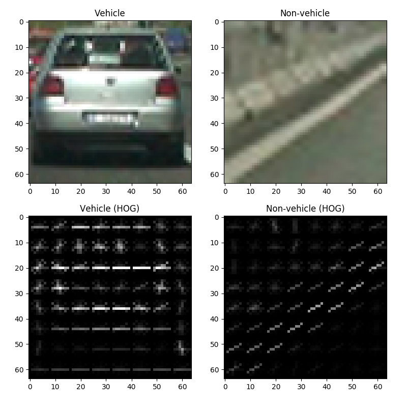
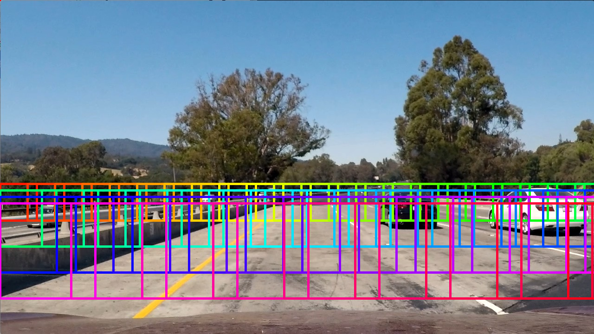
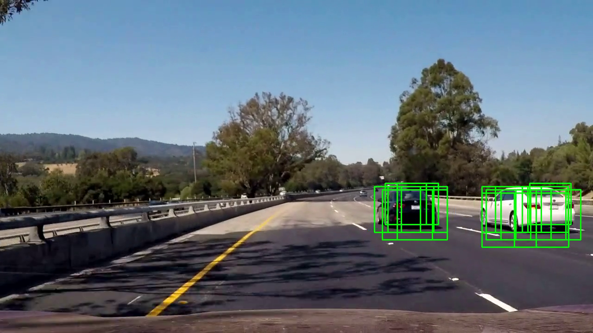
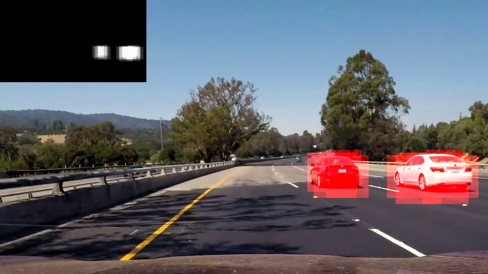
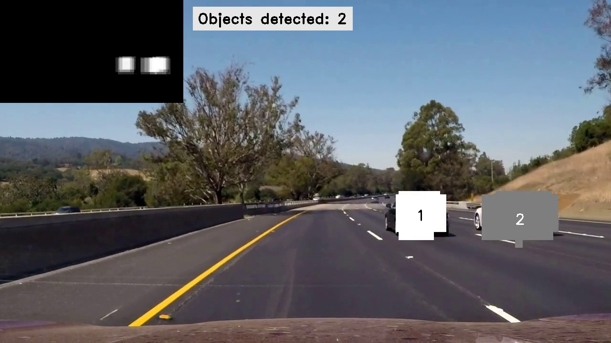

# HOG-based linear SVM vehicle detection

The files in this repo form a general framework for training and utilizing a HOG-based linear SVM to detect vehicles (or any other object) in a video. Although I'm not enrolled in the course and have never used Udacity, this project was inspired by the [vehicle detection project](https://github.com/udacity/CarND-Vehicle-Detection) from Udacity's self-driving car nanodegree program. I've used Udacity's sample image datasets (which were themselves taken from the [GTI](http://www.gti.ssr.upm.es/data/Vehicle_database.html) and [KITTI](http://www.cvlibs.net/datasets/kitti/eval_tracking.php) datasets) to train the SVM, and the project video provided by Udacity to test my SVM and object detection pipeline.

[Click here to watch the final video](https://youtu.be/uOxkAF0iA3E) with bounding boxes drawn around detected cars.

## Project overview

### Objectives

* Extract features from labeled (positive and negative) sample data, split into training, cross-validation, and test sets. Train classifier.
* For feature extraction, convert images to the desired color space, select the desired channels, then extract HOG, color histogram, and/or spatial features.
* Detect and draw bounding boxes around objects in a video using a sliding window and smoothed heatmap.

### Code and files

The pipeline consists of the following files:

* [descriptor.py](https://github.com/nrsyed/svm-vehicle-detector/blob/master/descriptor.py) defines a Descriptor class to extract the desired features from an image in the form of a feature vector.
* [train.py](https://github.com/nrsyed/svm-vehicle-detector/blob/master/train.py) contains two functions, one to extract features from sets of labeled training images (and split the data into training, cross-validation, and test sets), and another to actually train the SVM.
* [slidingwindow.py](https://github.com/nrsyed/svm-vehicle-detector/blob/master/slidingwindow.py) contains a helper function for implementing a sliding window search.
* [detector.py](https://github.com/nrsyed/svm-vehicle-detector/blob/master/detector.py) defines a Detector class that actually utilizes the trained SVM to detect objects in a video.

For detailed examples and information on using these files to train and implement the detection pipeline, see [INSTRUCTIONS.md](INSTRUCTIONS.md).

### Environment and dependencies

This is the environment in which I developed the project and tested the pipeline:
* Debian Stretch (9.4)
* OpenCV 4.0.0-pre and OpenCV-Python bindings
* Python 3.5.3
    * numpy
    * scikit-image 0.14dev
    * scikit-learn
    * scipy

The cutting-edge release of OpenCV isn't necessary. The code was also tested on Ubuntu 16.04 with OpenCV 3.3.0, and should work on older releases of OpenCV as well.

To extract HOG features, the Descriptor class allows you to select either the scikit-image HOG  implementation (`skimage.feature.hog`) or the OpenCV implementation (`cv2.HOGDescriptor`). You can also choose whether to extract features from 1, 2, or all 3 image channels. The development version of scikit-image (0.14) is necessary if you wish to use the scikit-image HOG implementation with multiple channels, as previous versions only support single channel images.

Also note that the OpenCV HOG implementation only supports 1, 3, and 4 channel images, not 2 channel images. Furthermore, the OpenCV HOG implementation allows both signed and unsigned gradients, whereas scikit-image only uses unsigned gradients.

## Methods

### Feature extraction and SVM training

Positive and negative sample data came from the [Udacity dataset](https://github.com/udacity/CarND-Vehicle-Detection), which contained 8799 images of vehicles viewed from different angles and 8971 images of non-vehicles (road, highway guardrails, etc.), all cropped and resized to 64x64 pixels. HOG, color histogram, and/or spatial features were extracted for each sample image. I experimented with a variety of color spaces (BGR, grayscale, HLS, HSV, Lab, Luv, YCrCb, YUV) and channels (any combination of 0, 1, 2) and HOG parameters (number of bins, cell size, block size, signed vs unsigned gradients). I tried both the scikit-image and OpenCV HOG implementations; the OpenCV function was roughly 5X faster than its scikit-image counterpart. I also experimented with varying numbers of color histogram bins and spatial feature sizes. Examples of a vehicle image and non-vehicle image are shown below alongside visualizations of their HOG gradient histograms.

After feature extraction, the feature vectors were scaled via `sklearn.preprocessing.StandardScaler`.

Finally, the sets of feature vectors were shuffled, then divided 75%/20%/5% into training, cross-validation, and test sets. I originally tried a 70%/20%/10% split but found that the classifier's performance on the test set (frequently >99%) was not necessarily indicative of its real-world effectiveness. Consequently, I chose to reduce the size of the test set.

The classifier itself was a `sklearn.svm.LinearSVC`. A number of parameters were tried for the SVC, including penalty, loss function, and regularization parameter. The training set was augmented with misclassifications from the cross-validation set and the classifier was retrained on this augmented training set before being evaluated on the test set, on which high accuracy (>99%) was frequently achieved.

### Object detection

A variable-size sliding window search was performed on each frame of the input video. Originally, I tried a fixed-size sliding window with an image pyramid to find objects at different scales, but this resulted in a relatively large number of false positives. Only the portion of the image below the horizon was searched to reduce computation and false positives (since there should be no vehicles above the horizon). An example of the variable-size sliding window can be seen below (as well as a link to a video of the technique).

[Link to sliding window example video](https://youtu.be/6e8XB-bKsZ4)

The rationale behind this sliding window approach is that vehicles in the vicinity of the horizon will appear smaller since they're farther away, while vehicles near the bottom of the image are closer and appear larger.

Due to window overlap, a single vehicle generally produced multiple overlapping detections:

[Link to video with raw detections drawn at each frame](https://youtu.be/TfX6jtuPL0I)

For each frame, a heatmap (in the form of a zero-initialized numpy array) was created by incrementing the pixels contained within each detection bounding box. In this scheme, regions of the image with multiple overlapping detections end up with large heatmap values. The heatmap for a frame is visualized below (note that the inset heatmap in the corner of the video is the same as the full-scale heatmap superimposed on the image, except the full-scale heatmap uses red to represent regions of "high heat").

[Link to video with superimposed heatmap](https://youtu.be/OT68xGggpkM)

The heatmaps of the last N frames were stored, and a weighted sum of the heatmaps was taken to produce a "summed heatmap" for the current frame, with older frames given less weight and more recent frames given greater weight. The summed heatmap was smoothed and thresholded to ignore pixels with low values. The remaining pixels were categorized into blobs (objects) by `scipy.ndimage.measurements.label()`.

[Link to video with labeled objects](https://youtu.be/iOt_3tQJBFY)

Finally, the largest possible bounding box was drawn around each blob, producing the result in the video linked at the beginning of this document.

## Results

### Parameter tuning and optimal parameters

I use the term "optimal" loosely here, as the parameters were tuned manually and the effects evaluated qualitatively. An improvement would be to systematically test a range of parameters and quantify the result on a labeled video (perhaps on [KITTI raw labeled data](http://www.cvlibs.net/datasets/kitti/raw_data.php)).

After much tweaking, trial, and error, I ended up with the following parameters:

**Feature descriptor parameters**

| Parameter		| Value |
|---			| ---	|
| Color space	| YCrCb	|
| HOG features	| True	|
| Color histogram features	| True	|
| Spatial binning features	| True	|
| HOG library	| OpenCV	|
| Channels		| 0, 1, 2	|
| Patch size	| (64, 64)	|
| Cell size		| (8, 8)	|
| Block size	| (2, 2)	|
| HOG bins (orientations)	| 20	|
| Signed gradients	| False	|
| Color histogram bins	| 16	|
| Spatial bin size	| (20, 20)	|

**SVM classifier parameters**

| Parameter		| Value	|
|---			| ---	|
| C (regularization parameter)	| 1000	|

All other SVM parameters were the `sklearn.svm.LinearSVC` defaults.

**Detector parameters**

| Parameter		| Value	|
| ---			| ---	|
| Sliding window initial size	| (90, 90)	|
| Sliding window x overlap		| 0.7		|
| Sliding window y step			| 0.01		|
| Sliding window x range		| (0.02, 0.98)	|
| Sliding window y range		| (0.55, 0.89)	|
| Sliding window scale-up		| 1.3	|
| Detector number of frames to sum	| 9	|

**Test set accuracy: 99.3%**

**Total feature extraction and training time: 29 s**

For an explanation of sliding window and detector parameters, see [slidingwindow.py](https://github.com/nrsyed/svm-vehicle-detector/blob/master/slidingwindow.py) and [detector.py](https://github.com/nrsyed/svm-vehicle-detector/blob/master/detector.py).

### Performance

**Frames processed per second: 3**

Test set accuracy did not necessarily correlate to commensurate "real-world" accuracy in the video. Detector parameters seemed to be at least as important as feature descriptor parameters.

At ~3 FPS, the algorithm was slow to process the video, taking about 7 minutes for 1 minute of video.

## Discussion

This project demonstrated that, while a HOG-based linear SVM can be effective for object detection, it also has the potential to be extremely finicky. Parameters must be carefully tuned and optimized to achieve anything remotely accurate.

Furthermore, the linear SVM was extremely slow. At 3 FPS, it was not nearly fast enough for real-time object detection. A number of things could be done to improve the speed: 1) optimize the existing code to reduce the number of necessary computations, 2) parallelize the code, 3) utilize the GPU, 4) compile with Cython, rewriting the code as necessary to take advantage of C features like static typing, or 5) throw more processing power at the problem! However, this might be more trouble than it's worth considering there are significantly faster algorithms and neural networks that would likely achieve real-time speeds without so much fuss.
